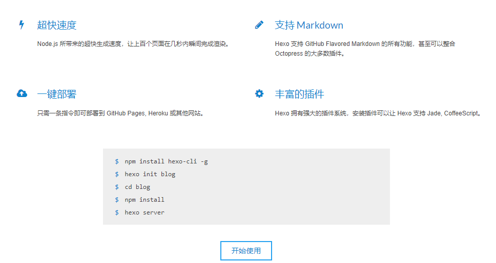
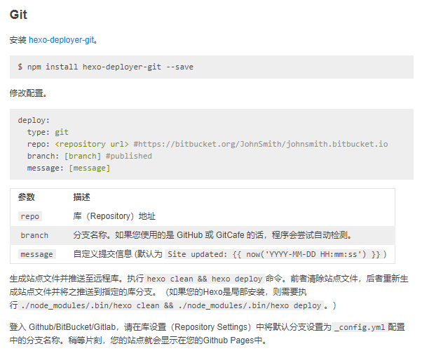
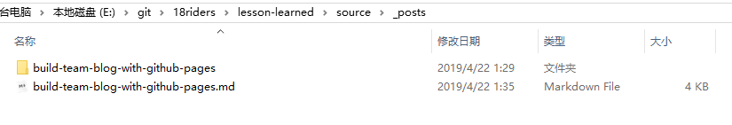
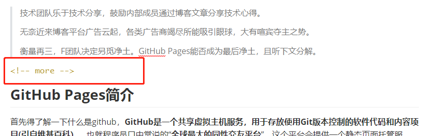
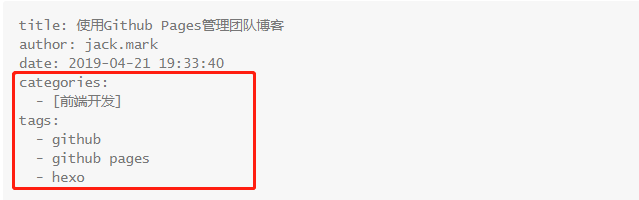
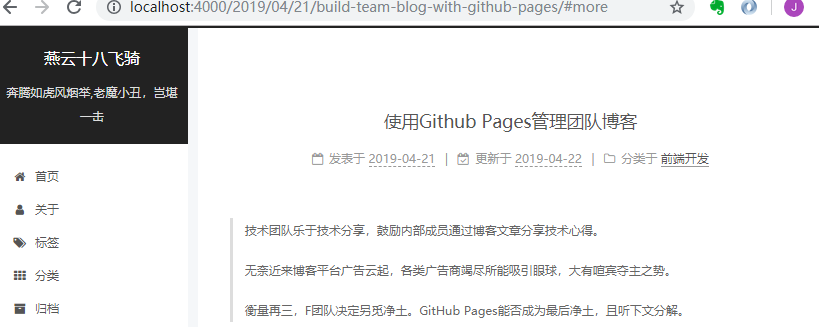

> 技术团队乐于技术分享，鼓励内部成员通过博客文章分享技术心得。
>
> 无奈近来博客平台广告云起，各类广告商竭尽所能吸引眼球，大有喧宾夺主之势。
>
> 衡量再三，F团队决定另觅净土。GitHub Pages能否成为最后净土，且听下文分解。

<!-- more -->

# GitHub Pages简介

首先得了解一下什么是github，**GitHub是一个共享虚拟主机服务，用于存放使用Git版本控制的软件代码和内容项目(引自维基百科）**。也就程序员口中常说的“**全球最大的同性交友平台**”，这个平台会提供一个静态页面托管服务。[GitHub Pages是这样介绍自己](https://pages.github.com/)，*"You get one site per GitHub account and organization,  and unlimited project sites. "* 简而言之，就是每个账号都拥有个同名的*username.github.io*站点可供个性化展示。

以下是官方展示使用命令行创建GitHub Pages页的样例：

```shell
$ git clone https://github.com/username/username.github.io
$ cd username.github.io
$ echo "Hello World" > index.html
$ git add --all
$ git commit -m "Initial commit"
$ git push -u origin master
```

只需几行命令就能拥有一个终身免费，免备案的静态站点。当然如果使用每次发布都要手写html文件的话有点让人受不了。好在GitHub对markdown格式极度友好，业界也对此开源了许多博客工具，如Hexo，Hugo，Jekyll等等。网上也有很多入门教程，如：《[傻瓜都可以利用github pages建博客](http://cyzus.github.io/2015/06/21/github-build-blog/)》。


# 工欲善其事必先利其器

F团队决定入坑GitHub Pages后，关于如何管理博客。成员M安利了[Hexo](https://hexo.io/zh-cn/)静态博客框架。

官方简绍如下：



看上去不难用，而且[Hexo文档](https://hexo.io/zh-cn/docs/)相当完善，安装hexo需要**Nodejs**环境，先去Nodejs官网下载装好再进行下一步操作。


再看一下[hexo的部署方式](https://hexo.io/zh-cn/docs/deployment)。



通过拜读hexo-deployer-git插件的部署方式，我们可以认为需要新建一个hexo项目对GitHub Pages进行发布。

于是通过`hexo init lesson-learned`初始化项目。

```shell
$ hexo init lesson-learned
INFO  Cloning hexo-starter to E:\git\18riders\lesson-learned
   ......
added 421 packages in 50.302s
INFO  Start blogging with Hexo!
```

至此，Github Pages的博客雏形算是搭好了。剩下的就是优化点了。

主要是追加`hexo-deployer-git`和`hexo-asset-image`两个插件。

`hexo-deployer-git`支持git deploy部署模式，自不用说。

`hexo-asset-image`支持图片相对路径引用。

# 开始写作

以本文为例吧，建议使用命令行初始化文章，文章命名使用英文和横杆连接，不要出现中文。

```
hexo new [post] build-team-blog-with-github-pages
```

上述命令会在`source/_posts`目录下生产同名文件和同名文件夹。



本文所引用的图片和其他资源都可以通过相对路径从文件夹中引入。写作使用markdown语法，就不展开了。

建议使用`<!-- more -->`标签将摘要和正文隔开，会使得段落更错落有致，如：



还有就是善用categories和tags标签，使文章能更好的进行分类



写作时可以一边写，一边执行`hexo s`命令，进行实时预览，能对文章进行更好的调整。

```
$ hexo s
$ INFO  Start processing
$ INFO  Hexo is running at http://localhost:4000 . Press Ctrl+C to stop.
```

在浏览器中打开<http://localhost:4000>查看效果。



更多的实用写作技巧可以查阅markdown详细语法，如表格、图表、数学公式之类的markdown有成熟的展示方案，还有的就是Hexo的[写作指南](https://hexo.io/zh-cn/docs/writing.html)，本文所有提及的知识点都能在上面找到。


# 团队协作

这块其实日常开发一样了，项目下加入成员。每个成员可以通过拉取分支再合并到主干模式写作，也可以自己直接推送到master分支上。推送完成，使用master分支执行`hexo g` 和`hexo d`命令发布到GitHub Pages上即可。

```shell
$ hexo g
$ hexo d
```

当然，强烈建议能形成一版操作规范。不然这种无审核的自由式写作很快会分化成一锅粥。


# 总结

很高兴团队能进一步拥抱GitHub生态圈，其实GitHub Pages除了作为博客平台外，很多个人和团队也将其作为自己项目的API说明和项目说明使用。如《Kafka技术内幕》作者的[Kafka技术内幕附录](http://zqhxuyuan.github.io/2017/12/31/Kafka-Book-Appendix/)；有赞团队的前端组件的[API文档](https://youzan.github.io/vant/)；当然还有很多开源翻译团体也在使用这项功能。此外，首个版本使用的主题是偏向简约型的`Next`主题，如有更合适的主题或优化方案可以持续优化。


