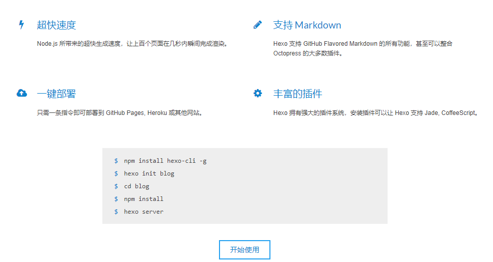
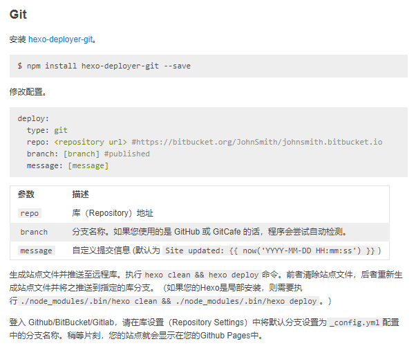

> F技术团队乐于技术分享，鼓励内部成员通过博客文章分享技术心得。无奈近来博客平台广告云起，各类广告商竭尽所能吸引眼球，大有喧宾夺主之势。衡量再三，F团队决定另觅净土。GitHub Pages能否成为最后净土，且听下文分解。

<!-- more -->

## GitHub Pages简介

首先得了解一下什么是github，**GitHub是一个共享虚拟主机服务，用于存放使用Git版本控制的软件代码和内容项目(引自维基百科）**。也就程序员口中常说的“**全球最大的同性交友平台**”，这个平台会提供一个静态页面托管服务。[GitHub Pages是这样介绍自己](https://pages.github.com/)，*"You get one site per GitHub account and organization,  and unlimited project sites. "* 简而言之，就是每个账号都拥有个同名的*username.github.io*站点可供个性化展示。

以下是官方展示使用命令行创建GitHub Pages页的样例：

```shell
$ git clone https://github.com/username/username.github.io
$ cd username.github.io
$ echo "Hello World" > index.html
$ git add --all
$ git commit -m "Initial commit"
$ git push -u origin master
```

只需几行命令就能拥有一个终身免费，免备案的静态站点。当然如果使用每次发布都要手写html文件的话有点让人受不了。好在GitHub对markdown格式极度友好，业界也对此开源了许多博客工具，如Hexo，Hugo，Jekyll等等。网上也有很多入门教程，如：《[傻瓜都可以利用github pages建博客](http://cyzus.github.io/2015/06/21/github-build-blog/)》。


## 工欲善其事必先利其器

F团队决定入坑GitHub Pages后，关于如何管理博客。成员M安利了[Hexo](https://hexo.io/zh-cn/)静态博客框架。

官方简绍如下：



看上去不难用，而且[Hexo文档](https://hexo.io/zh-cn/docs/)相当完善，再找一下[hexo的部署方式](https://hexo.io/zh-cn/docs/deployment)。



通过拜读hexo-deployer-git插件的部署方式，我们可以认为需要新建一个hexo项目对GitHub Pages进行发布。

于是通过`hexo init lesson-learned`初始化项目。

```shell
$ hexo init lesson-learned
INFO  Cloning hexo-starter to E:\git\18riders\lesson-learned
Cloning into 'E:\git\18riders\lesson-learned'...
remote: Enumerating objects: 3, done.
remote: Counting objects: 100% (3/3), done.
remote: Compressing objects: 100% (3/3), done.
remote: Total 71 (delta 0), reused 0 (delta 0), pack-reused 68
Unpacking objects: 100% (71/71), done.
Submodule 'themes/landscape' (https://github.com/hexojs/hexo-theme-landscape.git) registered for path 'themes/landscape'
Cloning into 'E:/git/18riders/lesson-learned/themes/landscape'...
remote: Enumerating objects: 16, done.
remote: Counting objects: 100% (16/16), done.
remote: Compressing objects: 100% (13/13), done.
remote: Total 893 (delta 3), reused 12 (delta 2), pack-reused 877
Receiving objects: 100% (893/893), 2.56 MiB | 47.00 KiB/s, done.
Resolving deltas: 100% (466/466), done.
Submodule path 'themes/landscape': checked out '73a23c51f8487cfcd7c6deec96ccc7543960d350'
INFO  Install dependencies
npm notice created a lockfile as package-lock.json. You should commit this file.
npm WARN optional SKIPPING OPTIONAL DEPENDENCY: fsevents@1.2.8 (node_modules\fsevents):
npm WARN notsup SKIPPING OPTIONAL DEPENDENCY: Unsupported platform for fsevents@1.2.8: wanted {"os":"darwin","arch":"any"} (current: {"os":"win32","arch":"x64"})

added 421 packages in 50.302s
INFO  Start blogging with Hexo!
```

